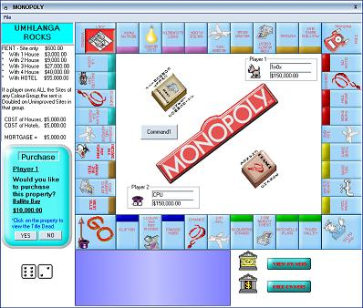



## Monopoly

### Description

My second game that I wrote. Not 100% finished, but I doubt I ever will since I am starting to learn VB2005. No error debugging was done any any comments will be helpfull. Please keep in mind that I am self taught and would also like to get an idea of where my skill level is. I know it is a 3mb file, but just imagen how long it took to make this game. The graphics are mostly mine, but the icons used for the animation is not....DO NOT SELL THIS GAME.

Go to the URL below for the original zip file to get the OCX files since they get removed by system admin.

OCX was only used to make the game visually more appealing. Something that some people seem to forget these days.

This is the new URL with the fixed controls.

URL:

http://upload2.net/page/download/XoXG2jo4Xyn9Vny/Monopoly.zip.html

Thank you.
 
### More Info
 

             |
---                |---
**Submitted On**   |2006-10-26 07:56:58
**By**             |[Michéle](https://github.com/Planet-Source-Code/PSCIndex/blob/master/ByAuthor/mich-le.md)
**Level**          |Intermediate
**User Rating**    |4.2 (21 globes from 5 users)
**Compatibility**  |VB 6\.0
**Category**       |[Games](https://github.com/Planet-Source-Code/PSCIndex/blob/master/ByCategory/games__1-38.md)
**World**          |[Visual Basic](https://github.com/Planet-Source-Code/PSCIndex/blob/master/ByWorld/visual-basic.md)
**Archive File**   |[Monopoly2028791132006\.zip](https://github.com/Planet-Source-Code/mich-le-monopoly__1-66988/archive/master.zip)

